# Blockstead

> A friendly, local dashboard for running a Minecraft: Java Edition server at home.

Blockstead is for the person who wants a reliable server for friends or family,
not a second career in Linux administration. It runs on a Linux Mint computer
beside the server files and gives you one clear place to start the server,
stop it safely, read its log, manage players, make backups, and set a daily
routine. It opens in your web browser; there is nothing extra to install on
your phone or laptop.

The dashboard is local-first: it listens on the computer itself by default and
never exposes a shell in the browser. You keep control of the server files;
Blockstead manages the process around them.

| | |
| --- | --- |
| 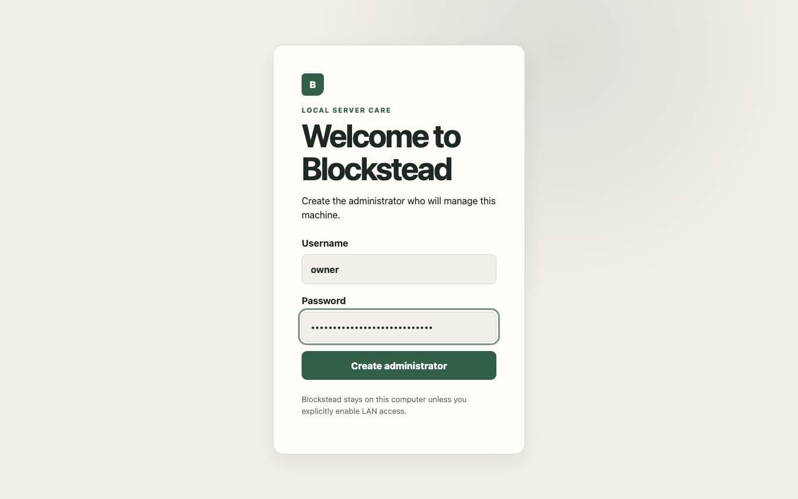 | 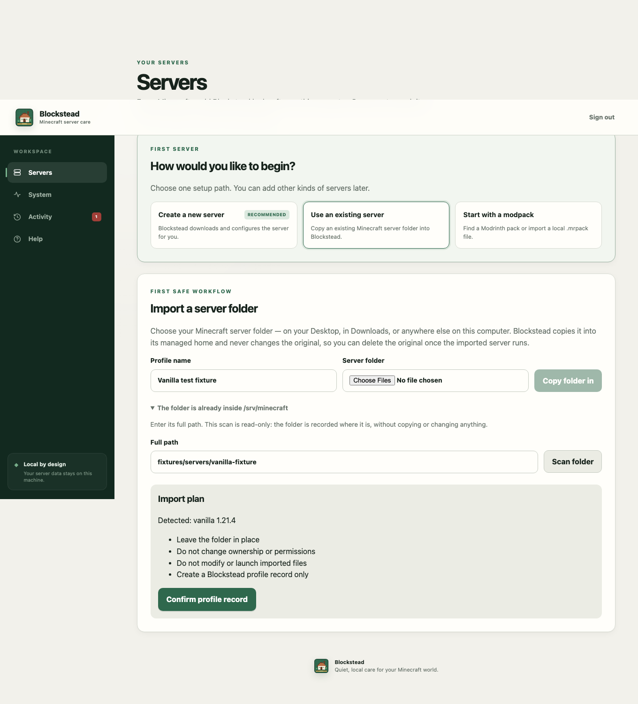 |
| First-run administrator setup | Read-only import plan |
| 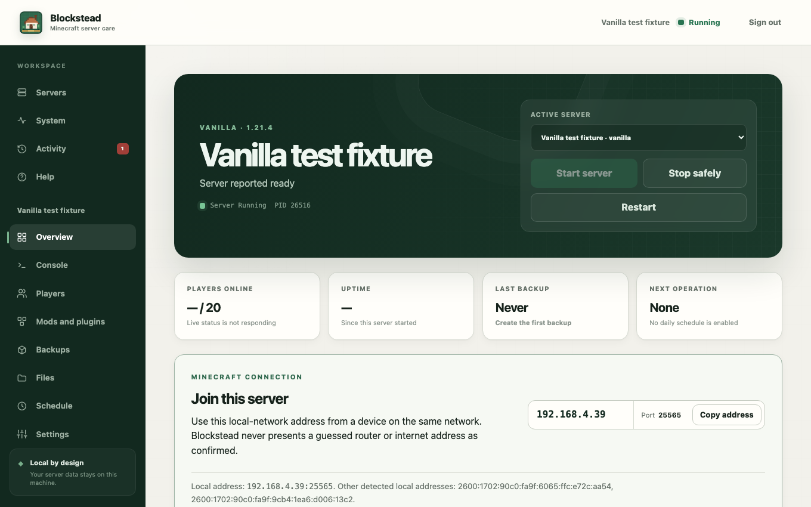 | 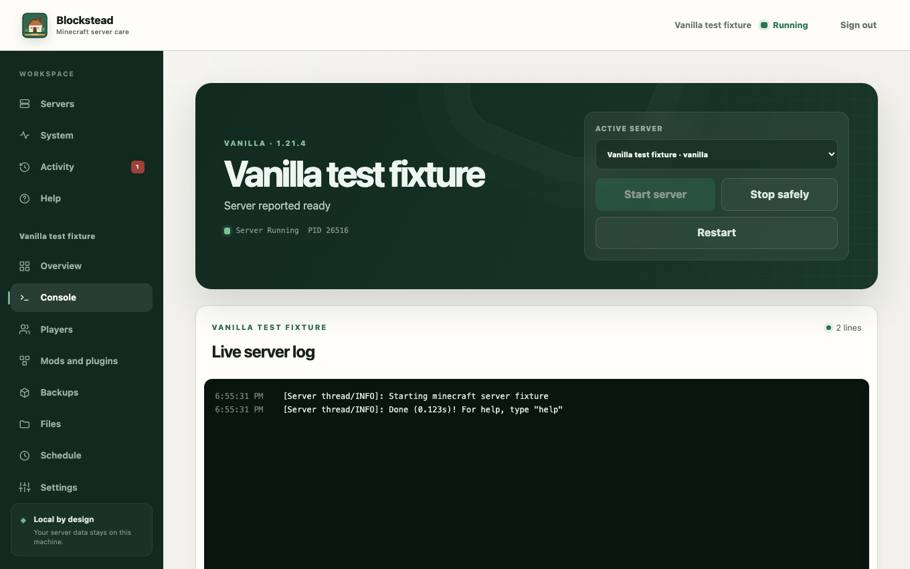 |
| Overview with the fixture running | Live log and guided quick commands |
| 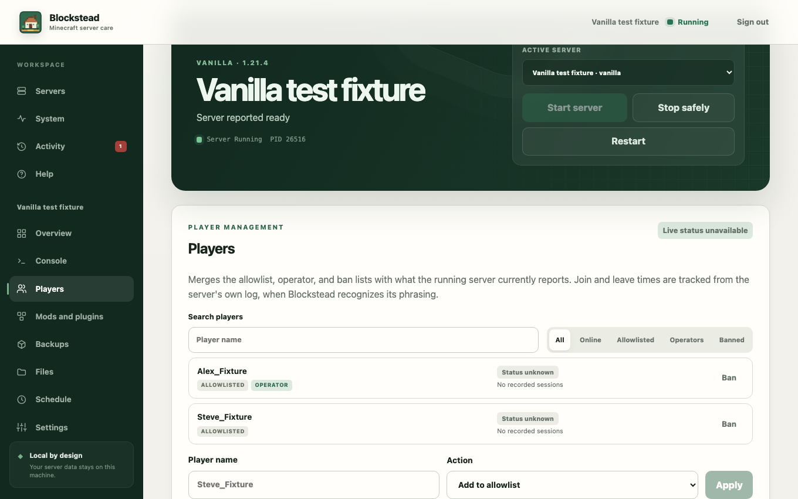 | 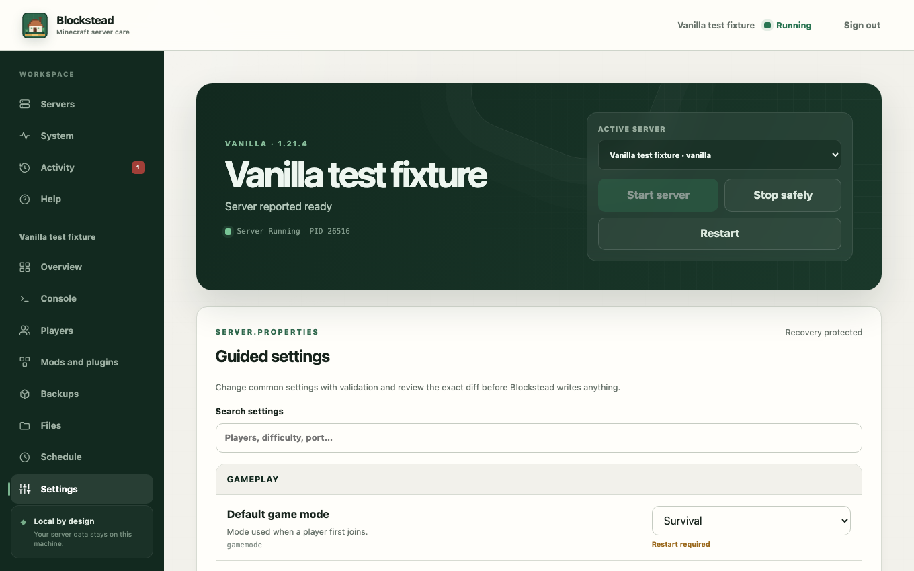 |
| Player management | Guided settings editor |
| 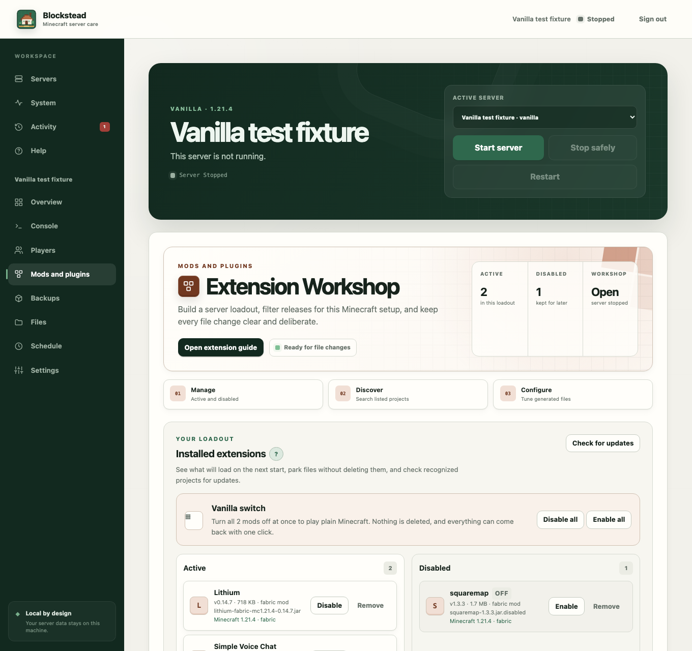 | 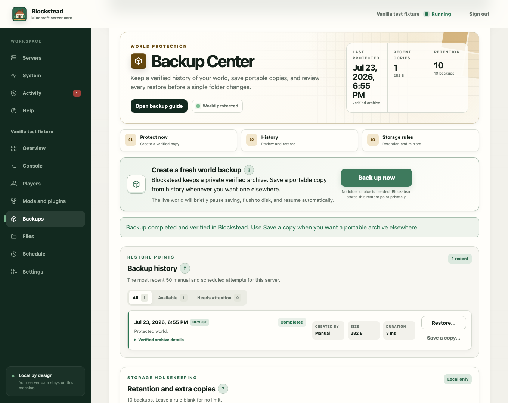 |
| Mods and plugins workshop | Backup Center with a verified restore point |
| 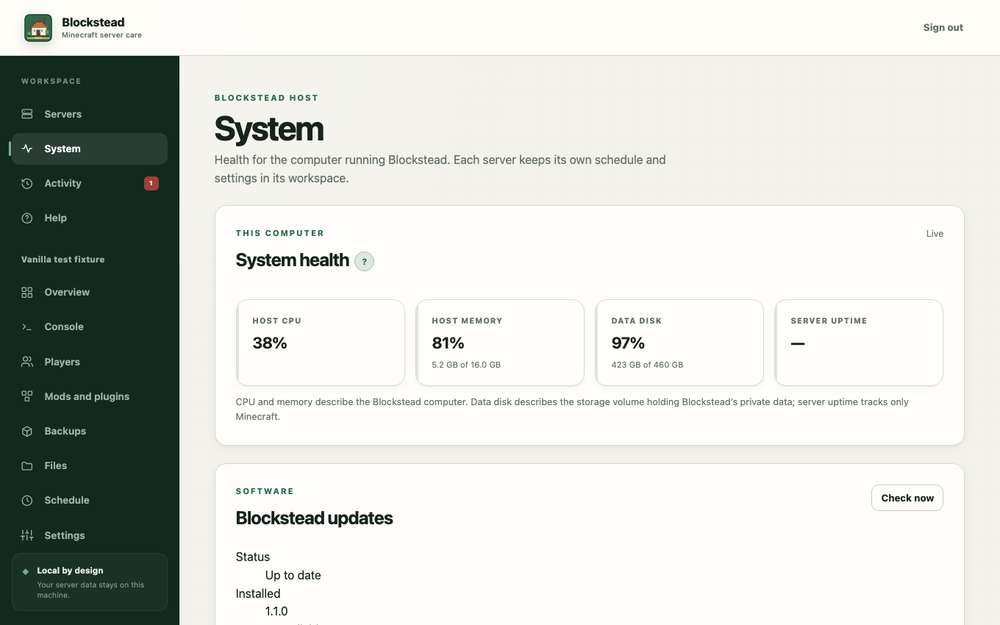 | 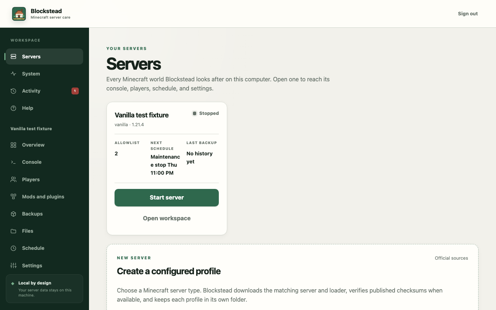 |
| System health | Every server on this computer |
| 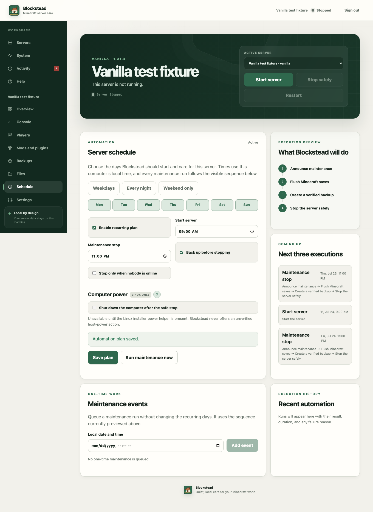 | 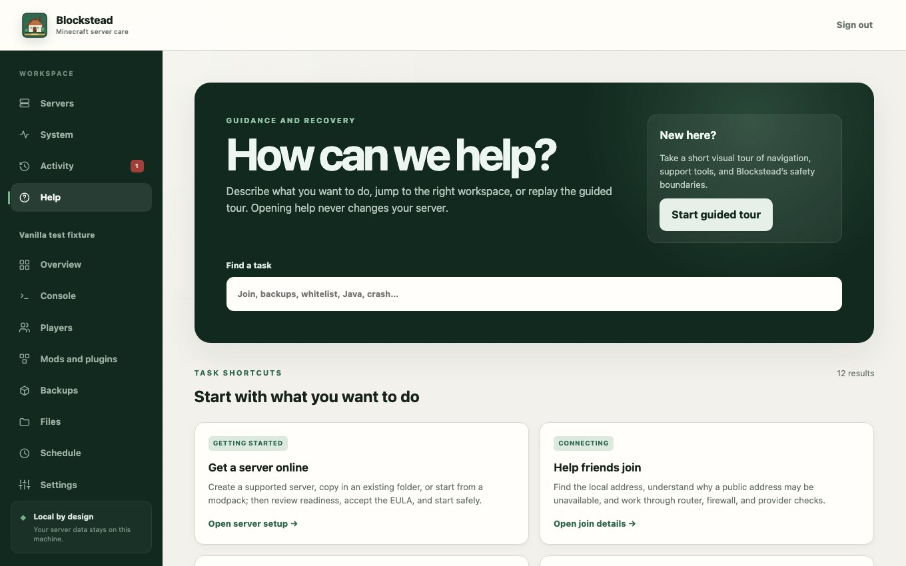 |
| Weekly automation plan | Searchable Help workspace |
| 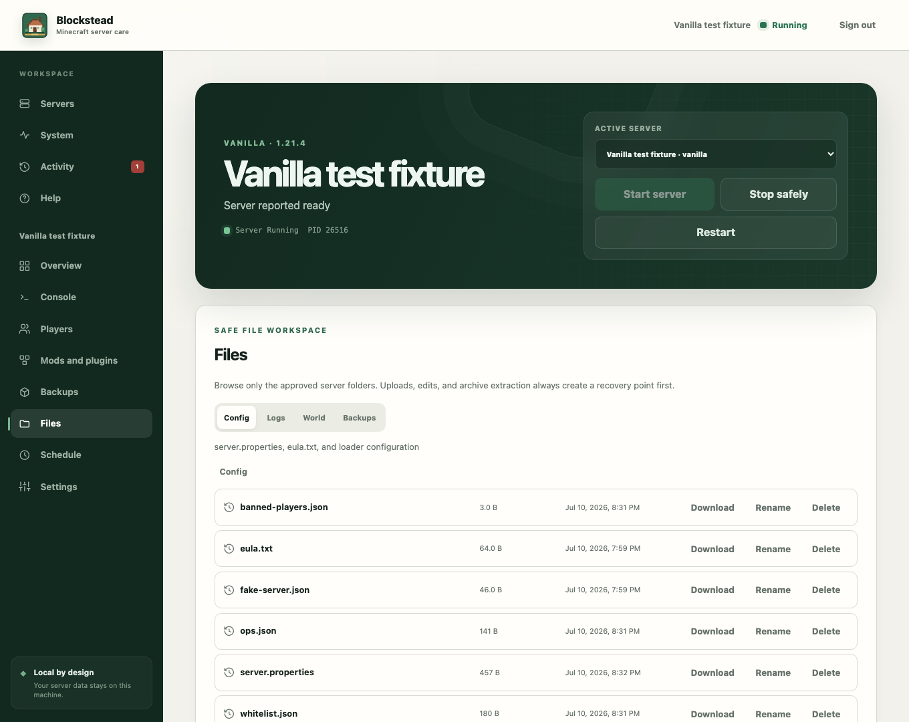 | |
| Safe file workspace with recovery snapshots | |

## What it does today

- lists every server it looks after, and gives each one its own workspace with a
  bookmarkable page for the console, players, mods, schedule, and settings
- imports an existing vanilla `server.jar` folder from anywhere on the computer,
  copying it in through the browser — no terminal or file moving required
- starts, stops, restarts, and watches the managed server process
- streams live server logs and sends one-line Minecraft console commands
- safely edits common server settings with validation, diff review, and recovery snapshots
- reads player lists, with guided allowlist/operator/ban actions
- shows host CPU, memory, disk use, and server uptime
- keeps a private application log and recent-error view, and saves a redacted
  one-file diagnostic report to attach when asking for help
- provides a filterable Activity timeline across every server, configurable
  local alerts for important failures and changes, and event-focused support
  reports that include the nearby application-log window
- includes a searchable Help workspace, keyboard-friendly contextual tooltips,
  recovery shortcuts, and an optional guided tour that can be replayed anytime
- saves weekday-aware start and maintenance schedules, plus one-time events;
  ordered maintenance runs announce, flush saves, optionally back up, and stop
  safely, with previews and result history
- gives mods and plugins their own friendly workshop: filter projects from
  Modrinth, Hangar (PaperMC), and CurseForge for the selected server; compare versions,
  categories, and sort orders; then install a checksum-verified release when
  the server is safely stopped. A one-click vanilla switch parks every
  extension without deleting anything, ready for the next game night
- checks installed plugins and mods for newer releases listed for that setup and updates
  the changed file with any newly required Modrinth dependencies once the full
  verified set is ready; changes promote as one transaction, so a failed file
  move restores the prior loadout instead of leaving mixed versions behind
- separates a detected LAN address from public reachability: it checks the
  current public IP at the overview, never treats a configured or dashboard
  address as public, and opens connection help when it cannot verify the route
- creates private, verified manual and scheduled world backups, keeps a clear
  per-server history, lets you save a portable copy when you need one, and can
  mirror successful archives to approved folders on another drive
- can optionally shut down the Linux computer after a safe stop and set an RTC
  wake alarm for the next scheduled day when the computer hardware supports it
- installs as a system service, so the dashboard starts with Linux
- installs a `blockstead` terminal helper and a menu entry that opens the dashboard

## What you need

- A Linux Mint 22.x computer (or a compatible Ubuntu-based system) that can
  stay powered on while players should be able to join.
- An administrator account on that computer. Linux asks for its password once
  during installation.
- A legally obtained Minecraft: Java Edition server folder, or the intention to
  create one. You must accept
  [Minecraft's EULA](https://www.minecraft.net/en-us/eula) yourself.

Everything else — Python, Node.js, Java 21, and the rest — is checked by the
installer, which offers to install any missing piece for you.

Docker Engine or Docker Desktop with Compose is an alternative to the native
Linux installation. The container image includes the dashboard runtime and
Java 21; Minecraft worlds and Blockstead data live in persistent Docker
volumes.

## Install on Linux Mint

The normal installation does not require a terminal:

1. [Download the approved Blockstead Linux ZIP](https://github.com/LordMalachi/blockstead/releases/download/update-channel/blockstead-linux.zip).
   This fixed link always points to the newest `main` build that passed CI.
2. Open the downloaded ZIP and extract the `blockstead-linux` folder.
3. Open that folder and double-click **Install Blockstead**. If Linux Mint asks
   whether to trust or launch it, choose **Trust and Launch**.
4. Choose **Install** and enter your administrator password when Linux asks.

The installer checks the computer, installs any missing requirements, shows a
progress window, adds the Blockstead app icon, and opens the dashboard when it
is ready. The ZIP itself is produced from the exact commit that passed
Blockstead's required checks. Its installer verifies the update-channel
manifest and installs that approved build; the extracted folder is not needed
for later updates.

If Blockstead was installed from a ZIP downloaded before automatic updates were
introduced, download the approved ZIP from the link above and run **Install
Blockstead** one more time. That one-time bootstrap installs the updater; future
updates require no new ZIP and preserve the existing settings, accounts,
backups, and worlds.

From the extracted approved ZIP, a terminal-based installation or automation
can use:

```bash
sudo bash ./scripts/install-linux.sh
```

If you prefer Git, check out the CI-approved moving tag rather than executing
an installer from the live, still-being-tested `main` branch:

```bash
git clone --branch update-channel --single-branch https://github.com/LordMalachi/blockstead.git
cd blockstead
sudo bash ./scripts/install-linux.sh
```

### First run

1. Create your Blockstead administrator account in the browser.
2. Create a new Vanilla, Fabric, Forge, Quilt, NeoForge, or Paper profile in
   the dashboard — or bring an existing server: choose **Use an existing
   server**, pick the server folder (on your Desktop, in Downloads, anywhere),
   and Blockstead copies it into `/srv/minecraft/` for you. The original folder
   is never changed, and you can delete it once the imported server runs.
3. Review and explicitly accept the Minecraft EULA, then choose **Start server**.
   That's it — the dashboard, and any schedule you
   set, now survive reboots.

### Recover a forgotten administrator password

On the Linux computer running Blockstead, open a terminal and run:

```bash
sudo blockstead reset-password
```

Enter the new password twice when prompted. The password is hidden while you
type and is never placed in shell history or a process argument. This recovery
requires the computer's Linux administrator authorization, replaces the local
Blockstead password, and signs out every existing dashboard session.

For a Docker Compose installation, run this from the Blockstead folder instead:

```bash
docker compose exec blockstead blockstead reset-password
```

### Imports and managed writes

Importing copies your folder; it never edits the original. A folder that
already lives in `/srv/minecraft/` can instead be recorded where it is with the
read-only **scan**, which never changes it. After an administrator explicitly
manages a profile, Blockstead can make narrowly scoped writes needed to operate
it: create profiles, record EULA acceptance, update `server.properties`,
install or disable mods and plugins, edit loader configuration, and create or
restore backups. These actions require authentication and CSRF protection;
risky file changes are staged, checked for stale revisions, restricted to the
selected profile, and given recovery copies where practical. Blockstead never
exposes a general-purpose shell in the browser.

## Run with Docker Compose

Docker is optional. It is a convenient app wrapper on Linux, macOS, or Windows
when you would rather keep Blockstead and Java out of the host operating system.
Docker installations do not run the native self-update helper. Refresh their
local source from the approved ZIP or `update-channel` Git tag, then rebuild the
container with Compose; [the Docker guide](docs/docker.md#logs-shutdown-and-upgrades)
has the exact update commands.

```bash
cp docker.env.example docker.env
docker compose --env-file docker.env up --build -d
```

Then open <http://127.0.0.1:8765>. The Compose setup publishes Minecraft on
port `25565` for LAN players, keeps the dashboard local to this computer, runs
Blockstead as an unprivileged user, and stores state in two named volumes:

| Volume | Contents |
| --- | --- |
| `blockstead-data` | Accounts, settings, audit records, and backups |
| `blockstead-servers` | Server profiles, worlds, mods, packs, and configuration |

Stop Minecraft from the dashboard before rebuilding or taking the container
down. `docker compose down` keeps both volumes. **Do not run
`docker compose down -v` unless you intend to delete Blockstead's data and all
managed Minecraft servers.**

View live container logs with `docker compose logs -f blockstead`. Use the
approved-source refresh steps in the Docker guide before rebuilding an upgrade.

LAN dashboard access, existing-world imports, extra ports used by mods, volume
backup guidance, and container limitations are covered in the
[Docker guide](docs/docker.md).

## Everyday use

Day to day you only need the dashboard: start and stop the server, watch the
live log, manage players, create backups, and set the weekly **Schedule**. The
computer just needs to stay on (or wake on its schedule, where supported).

### Help friends join

The **Join this server** card distinguishes a LAN address from an internet
address. It reads the actual Minecraft listening port from `server.properties`
and learns a LAN address only from the server's real bind setting and host
network interfaces. It never promotes the dashboard URL, a saved public IP, or
a Docker port setting as an externally reachable Minecraft address.

For an internet connection, Blockstead can ask a public-IP service for the
network's current public IP. It does not persist that value, and it cannot prove
which outside router port reaches Minecraft. Until the mapping is verified, it
will not show a guessed public `IP:port` address. Use the nearby **Connection
help** button to retry the check and work through the router, firewall,
carrier-grade NAT, and outside-network test steps. If Minecraft is bound only
to `127.0.0.1`, the same help offers an explicit, stopped-server-only repair to
allow local-network listening; it creates a recovery snapshot before changing
`server.properties`.

Blockstead does not configure UPnP, router forwarding, or firewall rules. If
you choose to invite players over the internet, make that mapping in your own
router and verify it from a network outside your home.

### Mods, plugins, and backups without the guesswork

The **Extension Workshop** is a good place to explore, even while friends are
playing. Search the catalog, compare projects, and use the version picker at
any time. Blockstead matches what it shows to the server's Minecraft version
and loader. When you are ready to install, update, upload, enable, disable, or
remove a jar, stop the server first — the page explains why and unlocks the
change controls once Minecraft is fully stopped. Disabling keeps a file handy
for later; removing it deletes that file after one last confirmation. After a
change, start the server and give the first few console lines a quick look.

The **Backup Center** is your world safety net. **Back up now** makes a private,
checksum-verified restore point; it does not ask you to pick a download folder.
Use **Save a copy** beside a completed backup when you want a portable archive
on your computer. The history shows manual and scheduled attempts, what needs
attention, and which archives are still available. Before a restore,
Blockstead checks the archive, disk space, and world folders it will replace,
then keeps the current folders beside the restored ones. Set retention rules to
keep the right number, age, or total size of primary archives, and optionally
mirror every successful backup to up to eight existing folders on the host.

Both pages have an **Open … guide** button for a short, in-context walkthrough,
plus small help buttons beside the choices that are easiest to second-guess.
For the full friendly reference, see [the mods, plugins, and backups guide](docs/mods-plugins-backups.md).

Click the **Blockstead** icon on the desktop or in the applications menu to
open it. The icon starts the dashboard service if necessary, waits until it is
ready, and then opens the correct address in your default browser.

For the occasional check-up, the installer adds a `blockstead` command to the
terminal:

| Command | What it does |
| --- | --- |
| `blockstead status` | Is everything running, and where do I open it? |
| `blockstead doctor` | Checks for common problems and says how to fix them |
| `blockstead logs` | Shows recent dashboard messages (`-f` follows live) |
| `blockstead update-logs` | Shows native updater messages (`-f` follows live) |
| `blockstead url` | Prints the dashboard address |
| `sudo blockstead start` / `stop` / `restart` | Controls the dashboard service |
| `sudo blockstead update` | Downloads and installs the newest Blockstead |
| `sudo blockstead uninstall` | Removes Blockstead, keeping worlds and settings |

Minecraft servers themselves are always started and stopped from the
dashboard, so saves are flushed and players are treated politely.

## Updating Blockstead

**Blockstead keeps itself up to date. Normally there is nothing to do.**

When Blockstead starts, and every few hours after that, it asks GitHub for the
newest commit on `main` that passed every required CI check. A push that is
still being tested, or one whose tests fail, is never offered to installed
copies. Blockstead downloads that exact approved archive, installs it, and
then tells you which build you are now on and what changed.

All native Linux installations use this same flow. It does not matter whether
the first copy came from the approved Git tag or approved ZIP, and updates do
not depend on the original folder still existing. The repository owner does not
have to create version tags, and installed users do not repeat ZIP downloads.

Updating is polite about your players:

| What is happening | What Blockstead does |
| --- | --- |
| No Minecraft server running | Updates straight away |
| Server running, nobody online | Stops it safely, updates, then starts it again if it was running before |
| Players online | Waits, and says so in the dashboard, until the server is empty |

Your settings, administrator accounts, backups, and Minecraft folders are
always preserved. A check or download problem changes nothing and is retried
later. Once installation begins, Blockstead builds the replacement before
stopping the dashboard in a private sibling directory, flushes it to disk, and
atomically swaps the complete application directory. It backs up the
application database, runs database migrations, and verifies the new version's
health endpoint. If installation or health verification fails, the previous
application and database are restored through the same atomic swap (with a
protected snapshot as a fallback), and the old version keeps running. Temporary
replacement and rollback trees are securely removed only after success.
Blockstead remembers that broken commit and does not automatically try it in a
loop. It can try again after a different commit passes CI, or when an owner
explicitly retries with `sudo blockstead update`.

**System → Blockstead updates** shows the installed version, the newest
available, and when it last looked. To update on the spot rather than waiting
for the next check, use **Check now** there, or run:

```bash
sudo blockstead update
```

Do not copy files directly into `/opt/blockstead`; that can leave obsolete
dependencies or mismatched dashboard assets behind. Update progress and the
last result appear in **System → Blockstead updates**. Read the updater's own
log with `blockstead update-logs` (add `-f` to follow it live).

### How the update is allowed to happen

The dashboard runs as an unprivileged account that cannot write `/opt` and
cannot use `sudo`. It never installs anything itself. It writes a small request
naming the approved commit into its own data folder; a root-owned systemd path
unit sees that file and runs `/usr/lib/blockstead/blockstead-update`. The helper
accepts nothing but a commit hash and independently fetches the fixed update
channel whose repository and URL live in that root-owned helper. It proceeds
only when the requested hash exactly matches the newest passing `main` commit,
then downloads that exact archive over HTTPS. The request cannot redirect the
helper to another repository or choose an arbitrary historical commit. Running
as a separate unit is also what lets the update survive the dashboard restart
it causes.

The fixed `update-channel` GitHub release and its small `latest.json` manifest
are advanced automatically only after the cross-platform tests, quality
checks, browser tests, packaging checks, and native updater integration tests
pass. That workflow also publishes the approved `blockstead-linux.zip` used for
new installations, and refuses to move the channel backward if an older job is
re-run or finishes late. The application still verifies its health after
installation and rolls back if the approved release does not start cleanly.

## If something goes wrong

Start with:

```bash
blockstead doctor
```

It checks the service, the dashboard page, Java, disk space, the port, and
recent errors, and prints a plain-language fix for anything it finds. Common
cases:

| Symptom | Usual fix |
| --- | --- |
| The dashboard page will not load | `blockstead status`, then `sudo blockstead start` if stopped |
| The server will not start, dashboard is fine | Java missing (`sudo apt install openjdk-21-jre-headless`) or `eula.txt` not accepted — the dashboard's readiness panel says which |
| “Port already in use” | Another program owns the port; `blockstead doctor` names it — stop it or change `BLOCKSTEAD_PORT` in `/etc/blockstead/blockstead.env`, then `sudo blockstead restart` |
| An update check or download failed | The installed version was not changed; Blockstead retries transient failures later, and `blockstead update-logs` has details |
| An installation or health check failed | The previous version was restored and that broken commit will not retry automatically; inspect `blockstead update-logs` |

To read live dashboard messages: `blockstead logs -f`.

## Uninstalling

Blockstead removes itself in careful steps so you cannot lose worlds by
accident:

| Command | Removes | Keeps |
| --- | --- | --- |
| `sudo blockstead uninstall` | Application, service, terminal helper, menu entry | Settings, accounts, backups, worlds |
| `sudo blockstead uninstall --purge` | …plus settings, accounts, **backups**, logs, service account | Worlds in `/srv/minecraft` |
| `sudo blockstead uninstall --purge --remove-minecraft` | Everything above **plus every world** | Nothing |

Deleting worlds requires typing a confirmation phrase, and no variant runs
while a managed Minecraft server is still up. After a plain uninstall,
reinstalling Blockstead finds your settings, accounts, backups, and servers
exactly where it left them.

## Where Blockstead keeps things

| Path | Contents |
| --- | --- |
| `/srv/minecraft/` | Your server folders and worlds |
| `/var/lib/blockstead/` | Administrator accounts, private data, world backups |
| `/etc/blockstead/blockstead.env` | Dashboard settings (address, port) |
| `/var/log/blockstead/` | Application logs |
| `/var/log/blockstead-update/update.log` | Root-owned native updater log (`blockstead update-logs`) |
| `/opt/blockstead/` | The application itself (replaced on update) |

## How it stays safe

- The dashboard binds to `127.0.0.1` by default; other devices on your network
  cannot reach it unless you explicitly opt in.
- There is no browser-accessible shell, and Minecraft console commands are
  never run through an operating-system shell.
- The service runs as an unprivileged `blockstead` account under a hardened
  systemd unit; only narrowly scoped helpers may power the machine off for the
  schedule feature or install an update, and each accepts a single fixed kind
  of input rather than a command to run.
- Destructive actions require confirmation, and risky operations create
  recovery copies first.

Details live in the [threat model](docs/threat-model.md) and the
[product specification](docs/product-spec.md).

## Development setup

Use the pinned Python 3.12 and Node 22 runtimes:

```bash
./scripts/bootstrap-dev.sh
./scripts/dev.sh
```

Open <http://127.0.0.1:5173>. The first dashboard flow imports the sanitized
`fixtures/servers/vanilla-fixture` folder and launches its safe Python fixture
process. Imported vanilla profiles with `server.jar` and an accepted `eula.txt`
can also be started from the dashboard. For a Fabric or Paper profile, use the
**Extensions** panel to inventory, search Modrinth, Hangar, or CurseForge,
install, upload, update, disable, or remove mods and plugins filtered for that
profile. Use **Modpacks** to install a Fabric pack from
Modrinth or import a local `.mrpack`; Blockstead creates a new profile and then
shows its Java, launcher, and EULA requirements in **Server readiness**.

Run all checks with `./scripts/test.sh`. Regenerate the documentation
screenshots with `npm --prefix frontend run screenshots`. Read
[CONTRIBUTING.md](CONTRIBUTING.md) before submitting changes.

## Documentation map

| Document | What it covers |
| --- | --- |
| [docs/product-spec.md](docs/product-spec.md) | The complete product and engineering specification |
| [update.md](update.md) | Current milestone roadmap and progress log |
| [docs/architecture.md](docs/architecture.md) | How the backend and frontend fit together |
| [docs/threat-model.md](docs/threat-model.md) | Security boundaries and assumptions |
| [docs/docker.md](docs/docker.md) | Docker Compose setup, storage, networking, and upgrades |
| [docs/mods-plugins-backups.md](docs/mods-plugins-backups.md) | Friendly guide to extensions, backups, restores, and extra copies |
| [docs/linux-mint-release-checklist.md](docs/linux-mint-release-checklist.md) | Manual acceptance testing before a release |
| [CHANGELOG.md](CHANGELOG.md) | Notable changes per release |

## Legal notes

Blockstead does not bundle Minecraft server software, mods, or packs, and it
never accepts the Minecraft EULA for you. When asked, it downloads selected
server and extension files from their official or Modrinth sources. Blockstead
is an independent project with no affiliation with Mojang, Microsoft, PaperMC,
Fabric, QuiltMC, Forge, NeoForged, or Modrinth.
