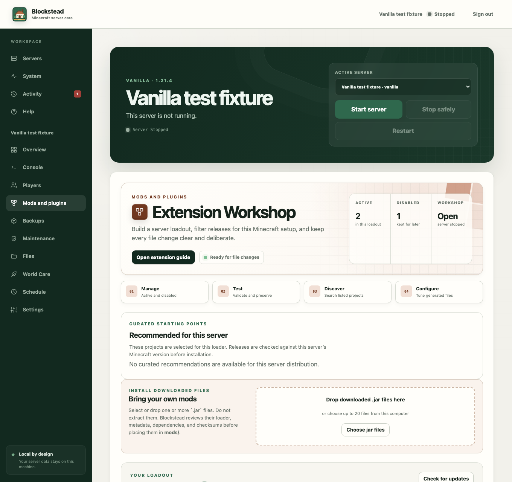
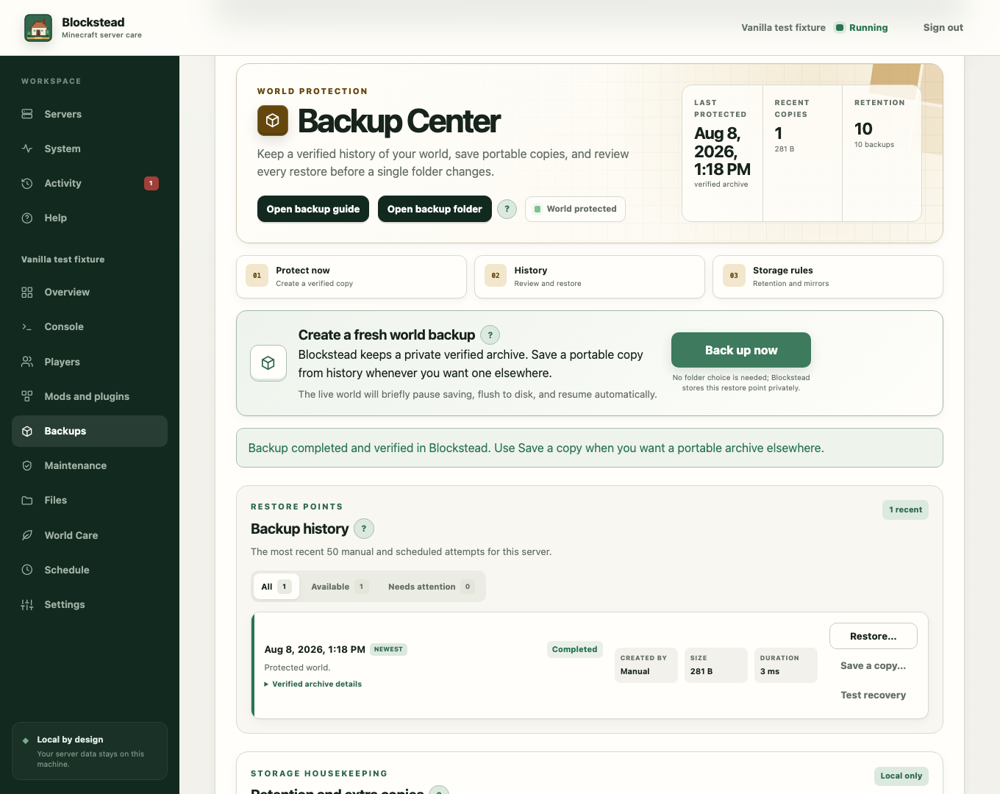

# Mods, plugins, and backups

Blockstead is here to make running a Minecraft server feel more like hosting a
world for friends and less like sorting through mystery files. This guide covers
the three workflows that change the most important things: creating a protected
modded copy, managing its add-ons, and protecting its world with backups.

## Create a protected modded copy

Open **Maintenance** on any recognized Vanilla, Paper, Fabric, Forge, NeoForge,
or Quilt profile and choose **Create a modded copy**. Blockstead keeps the same
Minecraft version and asks which target you want:

- **Paper** runs server-side plugins. Players normally connect with ordinary
  Minecraft unless a particular plugin says otherwise.
- **Fabric**, **Forge**, **NeoForge**, and **Quilt** run mods. Players often need
  a matching client loadout.

This is a copy, not an in-place conversion. Blockstead requires the source
server to be stopped and a verified backup made within the last 24 hours. It
checks Java, free disk space, world size, loader availability, and extension
compatibility before showing the final review.

The copied world includes the configured overworld, Nether, End, builds, player
inventories, advancements, statistics, and other world-contained data. The
source profile, source folder, and verified backup stay unchanged. Loader files,
configuration, `mods`, `plugins`, and disabled-extension folders are not copied.
Copying jars between loaders is unsafe, so the new profile receives a fresh
extension checklist instead.

Worlds that have already stored blocks, entities, dimensions, or registries
from mods need extra care. If equivalent target mods do not exist, that content
may be missing or the world may refuse to load. Blockstead calls this out and
requires an acknowledgement; it cannot manufacture cross-loader compatibility.

After creation, Blockstead opens the new profile's **Mods and plugins**
workspace. The copy remains stopped until you review its loadout, accept the
Minecraft EULA, and choose to start it. If anything is wrong, return to the
untouched source profile or restore its retained backup.

## The Extension Workshop

Open **Mods and plugins** for the selected server. The workshop knows whether
your server uses Paper plugins or Fabric, Forge, Quilt, or NeoForge mods. A
Vanilla server does not load extension jars, so Blockstead points you toward the
right kind of profile instead of pretending an install will work.

### Find something fun

Use **Discover** to search Modrinth, Hangar (for Paper plugins), or CurseForge.
Blockstead filters projects and releases using the Minecraft version and loader
for the server you have open. You can search, change catalogs, filter by
category, sort, page through results, and open **Versions** to choose a specific
build that declares support for that setup. Metadata can rule out some obvious
mismatches, but it cannot guarantee that every group of add-ons will work
together.

Browsing is always fine. Installing, updating, uploading, enabling, disabling,
and removing files wait until Minecraft has stopped cleanly. Minecraft loads
jars at startup and can keep them open while it runs, so stopping first keeps a
half-finished change from becoming a confusing startup problem.

CurseForge needs its own API key before that catalog can be searched. The
workshop asks for it only when you choose that source, and says clearly if
saving or searching the key does not work.

Catalog installs are only offered when the publisher supplied a checksum, and
Blockstead verifies every file before it reaches the live `mods` or `plugins`
folder. If a project needs several catalog dependencies, they are all checked
before any of them are made live. Paper plugins sometimes name prerequisites
without a catalog address; Blockstead asks you to install those named plugins
first instead of guessing which jar to fetch.

### Install files you downloaded

Choose **Install downloaded files** beside Discover. Drop or select up to the
displayed batch limit of `.jar` files at once. Do **not** extract them. A
Modrinth `.mrpack` is a complete modpack and belongs in the separate modpack
import workflow, not here.

Blockstead uploads the batch to private temporary staging and inspects it before
anything reaches the server. The review shows the detected name, version,
extension type, supported loaders, Minecraft constraint, client/server
environment, dependencies, SHA-256, and final destination:

- Paper files go to `plugins`.
- Fabric, Forge, NeoForge, and Quilt files go to `mods`.

Invalid archives, unsafe names, oversized files, duplicate or conflicting
files, known loader mismatches, and known client-only files are blocked.
Unrecognized metadata can be installed only after you acknowledge that
Blockstead could not verify compatibility or origin. Missing required
dependencies can be satisfied by another staged jar or a compatible result from
the filtered catalogs.

Accepted batches are applied together: either every reviewed file is promoted
or none is. Manually supplied files then use the same inventory, Activity
history, enable/disable, update matching, and removal controls as catalog
installs. A locally calculated SHA-256 proves that the reviewed bytes did not
change; it does **not** prove who published them. Only install jars from sources
you trust.

### Keep your loadout tidy

**Manage** separates active files from files you have disabled. Each item shows
what Blockstead could recognize: version, file name, size, loader, and declared
Minecraft version information when available.

- **Check for updates** looks for a newer release listed for this setup for
  recognized Modrinth files. Any required dependencies for the chosen update
  are resolved and verified with it. Blockstead stages the complete replacement
  set, then promotes every jar as one transaction. It parks the old jars in a
  private rollback area until every promotion succeeds; a failure restores the
  prior loadout, while a success securely cleans up only those retired jars.
  If an update is rolled back, Blockstead also restores the file's recorded
  source information so later update and export decisions remain accurate.
- **Disable** parks a jar in Blockstead's managed disabled area. It is a great
  way to troubleshoot or run a plain-Minecraft session without losing your
  usual setup.
- **Vanilla switch** disables every active extension at once, or brings the
  saved loadout back. Nothing is deleted.
- **Remove** permanently removes that jar after a confirmation. Use Disable if
  you think you might want it back soon.
- **Test private startup** clones the server into a disposable local workspace,
  binds it to loopback on an ephemeral port, and creates a disposable world.
  Your real world is never started by the test. When an explicitly reviewed
  batch produces a clear extension-loading error, only that batch can be moved
  to Blockstead's disabled area. Java errors, timeouts, and unrelated crashes do
  not cause automatic quarantine.
- **Export loadout lockfile** records the exact active and disabled file names,
  checksums, recognized metadata, loader, and Minecraft version. It is useful
  for auditing or rebuilding a server, but it does not redistribute jars.
- **Review player pack** shows which verified client-required Modrinth files can
  be included, which files need manual download, which server-only files are
  excluded, and any disclosures. Download is enabled only for that reviewed
  loadout; changing a jar makes the review stale.

The **Configure** area is for supported generated configuration files. Change
one thing at a time, then start the server and check the early console messages
if an add-on is new or updated.

### Recommended owner workflow

1. Stop the source server and make a fresh verified backup.
2. Use **Maintenance → Create a modded copy**, read the review, and create the
   separate target.
3. Review the migration checklist. Reinstall compatible extensions from the
   filtered catalogs or use **Install downloaded files** without extracting jars.
4. Resolve every required dependency and apply the reviewed batch.
5. Accept the Minecraft EULA, then run **Test private startup**.
6. For modded clients, review and download the player pack; give players its
   manual requirements too.
7. Start the real target only after the private test passes. Watch the first
   console startup for dependency, registry, map-port, or configuration errors.
8. If the result is not right, stop the target. Disable the new batch, use its
   lockfile to compare changes, or return to the untouched source and backup.

Never delete the old profile or its backup until the modded copy has survived a
few normal starts and you have confirmed player inventories, builds, Nether,
End, and any map plugin behavior.

## The Backup Center

Open **Backups** for the selected server. Think of each completed archive as a
restore point: a private copy Blockstead can check before it uses it.

### Make a restore point

Choose **Back up now** whenever you want a fresh snapshot. If players are
online, Blockstead briefly pauses saving, flushes the world to disk, creates the
archive, and turns saving back on. A short pause is normal.

Blockstead stores the finished archive privately and records a manifest and
SHA-256 checksum with it. The page shows progress, success, failure, and the
most recent protection status. Scheduled backups appear in the same history as
manual ones.

Want a copy you can carry elsewhere? Find a completed archive in **History**
and choose **Save a copy**. Your browser downloads it, or you can choose a
folder where the browser supports picking one. Creating a normal Blockstead
backup never requires a download or folder choice.

### Read your history

The history has three views:

- **All** shows recent manual and scheduled attempts.
- **Available** shows completed archives that can be restored or saved.
- **Needs attention** collects failed, expired, or unavailable entries.

Open **Verified archive details** on a completed record to see its checksum and
archive name. A completed entry can still say its archive is unavailable if the
underlying file was removed outside Blockstead; it stays in history so the
missing restore point is not a mystery.

### Restore carefully

Choose **Restore…** beside an available completed archive. The server must be
stopped. Before the final button appears, Blockstead checks the archive checksum
and free disk space, lists the world folders it will replace, and shows the
Minecraft version recorded with the backup.

When you confirm, Blockstead stages and verifies the contents before swapping
them in. The current world folders are kept beside the restored ones, so you
have a safety net if you change your mind. Read the review screen; it is the
moment to pause.

### Decide how much to keep

Under **Storage rules**, you can set any combination of a maximum number of
primary backup copies, a maximum age in days, and a primary-storage budget in
MB. Leave a rule blank when you do not want that limit. Rules work together
after a successful backup, so making them tighter can remove older primary
archives right away. Blockstead always keeps the newest completed primary
backup.

For an extra layer of protection, expand **Copies on another drive**. Add up to
eight existing absolute folder paths on the computer that runs Blockstead, turn
on mirroring, and save the settings. Every successful manual or scheduled
backup is copied there. Mirrored copies are intentionally not pruned by primary
retention rules. Docker users need to mount the host folder into the container
first and enter the container path.

## Help is always nearby

Both workspaces include an **Open extension guide** or **Open backup guide**
button. Those short guides explain the safe workflow without leaving the page.
Small question-mark buttons explain project filtering, stopped-server
locks, live backups, verification, retention, and approved mirror folders.

The top-level **Help** page also links directly to these workspaces. Search for
`migration`, `mods`, `plugins`, `backup`, `restore`, `retention`, `mirror`, or
`CurseForge` to bring up the relevant guide. None of the guides changes your
server on its own.
