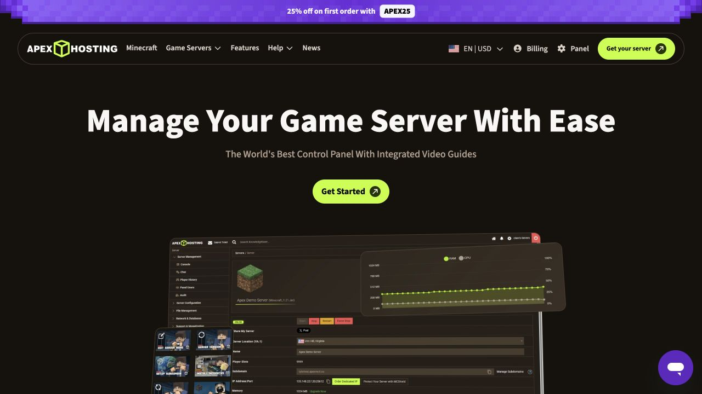
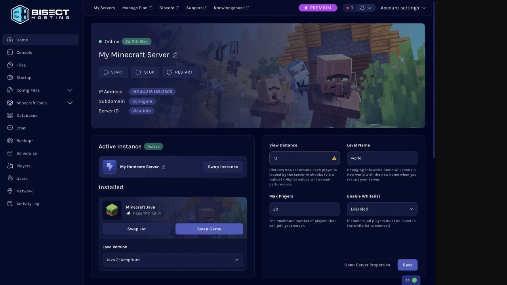
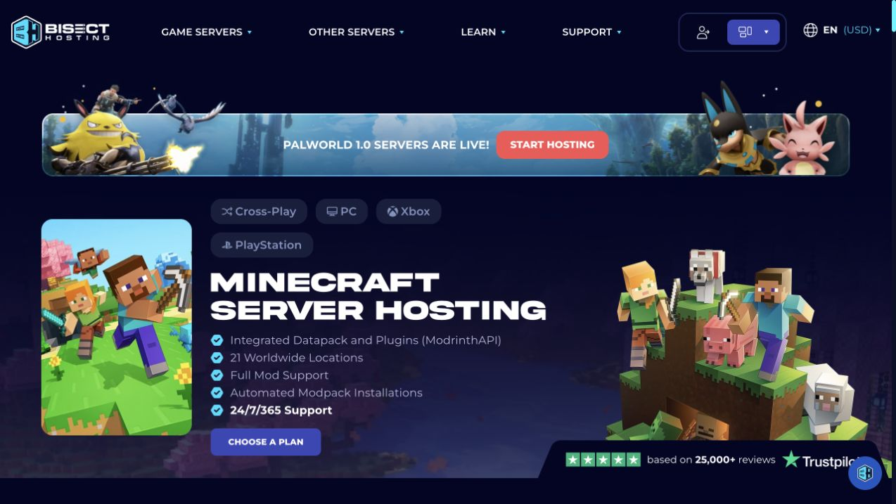

# Future project ideas

**Status:** Unprioritized future ideas — not a milestone plan or delivery
commitment.

This is a parking place for possibilities worth revisiting after the current
roadmap.  They should be assessed against Blockstead's local-first,
single-owner, safety-first product direction before being promoted into
`update.md`.

## Product guardrails

- Borrow interaction patterns, not the hosting-company business model.
- Keep Minecraft's real state and any irreversible consequence clear before an
  owner acts.
- Prefer a guided, reversible path over exposing a general-purpose server
  administration surface.
- Keep normal care calm and compact; let advanced detail be available on demand.

## Idea shelf

| Idea | Owner benefit | Shape worth exploring | Keep / avoid |
| --- | --- | --- | --- |
| **Today on this server** | Answers “can friends play, and is the world protected?” at a glance. | A compact, action-oriented summary of server state, join address, player count, last backup, next schedule, and only the next appropriate action. | Keep the calm overview; avoid hosting-style CPU/RAM graphs as the headline. |
| **Maintenance preflight** | Makes updates, mod changes, and restarts feel safe rather than ritualistic. | A checklist that identifies connected players, a recommended backup, needed stop/restart, expected downtime, and a final reversible plan. | Explain the why; never silently stop a server or make a backup look successful before verification. |
| **Saved server setups** | Lets a household keep a vanilla game night and a modded experiment without confusing file swaps. | Explicitly named, backed-up “setups” that state what will be parked, restored, and restarted before the switch. | Treat it as a deliberate local profile/restore workflow, not instant cloud game swapping. |
| **Purpose-built settings cards** | Replaces the most intimidating config-file edits with plain-language controls. | Optional specialist cards for common ecosystems (for example, Paper performance, Geyser cross-play, or a selected modpack), each with sources, defaults, validation, and a diff. | Keep the existing raw editor as an advanced escape hatch; do not hard-code a vendor-specific configuration system. |
| **World care center** | Gives owners approachable, preventative choices for a world that is getting heavy or risky. | A guide for world size, free disk, backup age, rendering advice, and safe links into existing backup/settings actions. | Lead with evidence and a preview; avoid destructive cleanup or region deletion as a one-click “fix.” |
| **Friendly incident timeline** | Helps an owner understand “what changed?” after a problem without reading logs. | A merged timeline of start/stop, schedules, backups, extension changes, settings edits, and meaningful warnings, with deep links to the original evidence. | Preserve the raw log; do not claim a causal explanation where only correlation is known. |
| **Player-ready checklist** | Makes it easier to share a server with friends while retaining a home-hosted posture. | A concise readiness card: copyable join address, allowlist state, server version, online status, and optional map availability. | Do not add remote exposure, port forwarding, or account-sharing automation. |
| **Extension change review** | Helps owners understand an install/update beyond its version number. | A change card with compatibility, required stop/restart, backup recommendation, project source, file size, checksum result, and rollback path. | Retain verification and stop-state safeguards; never auto-update an extension while players are online. |

## Competitor inspiration board

The references below are for interface and workflow inspiration.  They are not
requirements to add multi-tenant billing, remote file access, game swapping,
or cloud-host features to Blockstead.

### 1. Apex Hosting — persistent workspace plus visible lifecycle state

**What is compelling:** Apex presents the game panel as a consistent workspace:
the left rail carries the tool map, the main view names the server, and the
running-state actions are highly visible.  Its public feature page also calls
out in-context video guides alongside console, file, configuration, version,
and performance tools.

**Blockstead translation:** Preserve the current selected-server workspace and
keep start/stop/restart easy to find.  The useful idea is a small, contextual
“what can I do here?” guide next to risky or unfamiliar tools—not a denser
hosting control panel.  Blockstead should continue to make backup state,
safety checks, and plain-language status more prominent than raw resource
charts.

Source: [Apex Hosting features](https://apexminecrafthosting.com/features/).

### 2. BisectHosting — clear dashboard hierarchy and guided server settings

**What is compelling:** The panel establishes hierarchy quickly: online state,
server name, and primary actions appear before detail.  It pairs a familiar
navigation rail with selected-server controls, settings fields that explain
their impact, an instance switcher, and dedicated backup/schedule/player areas.
The public page also uses a short, game-specific checklist instead of leading
with technical infrastructure.

**Blockstead translation:** Use the hierarchy—not the commercial visual style.
The strongest future opportunities are a “Today on this server” summary,
purpose-built settings cards with consequences in plain language, and a
friendly incident timeline that connects the existing backup, schedule, player,
and change evidence.  Any future saved-setup workflow must include an explicit
backup/restore plan and clear downtime expectations.

Sources: [BisectHosting Minecraft hosting](https://www.bisecthosting.com/minecraft-servers),
[BisectHosting help center](https://help.bisecthosting.com/hc/en-us).

### 3. Nodecraft — specialist workflows instead of raw configuration

Nodecraft's Minecraft and Pixelmon materials emphasize one-click installers,
cloud backups, scheduled tasks, saved instances, player administration, and
specialized settings screens that replace raw configuration formats with
fields and toggles.  Its setup guidance also adds performance warnings during
server creation and recommends a nearby data-center location.

**Blockstead translation:** The durable idea is *progressive specialization*:
for recurring, high-confidence tasks, offer a guide or settings card that
explains the choice and preserves an advanced route.  For a local home server,
performance guidance should inspect only honest local signals (free disk,
memory pressure, server version, and known extension compatibility) and state
its limits—rather than pretending to estimate network latency or offering
hosting locations.

Sources: [Nodecraft Minecraft hosting](https://nodecraft.com/games/minecraft-server-hosting),
[Nodecraft instance guide](https://nodecraft.com/support/knowledgebase/nodepanel/what-are-instances-and-how-to-use-them),
[Nodecraft Pixelmon panel examples](https://nodecraft.com/landing/pixelmon).

### Patterns to deliberately leave behind

- Billing, plan-selection, sales banners, and global-location selectors.
- Full remote FTP/SFTP and broad file-manager access as the default path.
- Aggressive “one click” language for actions that could interrupt players or
  replace a world.
- Dark, information-dense dashboards as the only design mode; Blockstead is
  more approachable when its screen stays quiet until an owner needs detail.

## Research notes

- Screenshots captured on 2026-07-20 from publicly accessible vendor pages.
  They are retained here solely as interface references; the vendors retain all
  rights in their imagery and products.
- A small number of market patterns repeated across the reviewed sources:
  server status plus lifecycle controls, a persistent tool map, backups and
  scheduling, extension/version management, player controls, and an
  “instance” or saved-setup concept.  The value for Blockstead is not feature
  parity—it is making the safe local equivalent obvious and understandable.
